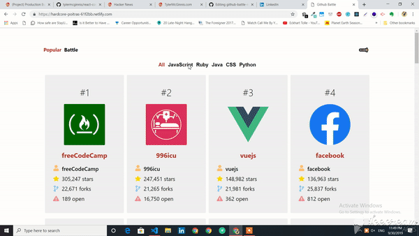

# React-Github-Battle
React App (React Fundamentals Course)

<!---  LOGO   -->

<!---  SHIELDS   -->

&nbsp

__Github Battle__ is a React App that pulls data  from the [Github API](https://developer.github.com/v3/) to achieve multiple actions like Github Users Battle, Most 
Popular Repos and User Info, responsive and Service Worker running, animations with [gsap](https://greensock.com/gsap) super snappy for quick switching thanks to React 
Virtual DOM í´¥

 This app is the final result of the course __React Fundamentals__ which you can find [here](https://learn.tylermcginnis.com) + other additions like animations and extra 
functionality

<a href="https://hardcore-poitras-61f2bb.netlify.com/" class="btn btn-primary btn-md">Launch App</a>

## Features

*  __Simple__: Set up with Webpack and Babel [Webpack](https://webpack.js.org/) and using 
[React](https://facebook.github.io/react/)

* __Real-time__: Data obtained from the [Github API](https://developer.github.com/v3/)

* __Responsive__: Made mobile responsive with Flexbox

* __Live__: Deployed with [Netlify](https://www.netlify.com/)

<!---  SCREENSHOOT   -->

## Demo

    

